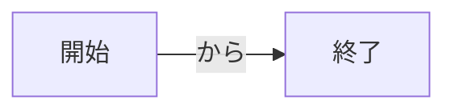

# 実験屋の研究室技術ノート

このリポジトリは、
筆者（[望月 圭](https://researchmap.jp/keimochizuki)）
の所属において必要となった技術事項について、
記録・共有するためのファイル置き場です。

以下mermaidのテスト。

```mermaid
flowchart LR;
A[Start]--To the-->B[Goal];
```

```mermaid
flowchart LR;
A["Start"]--"To"-->B["Goal"];
```

```mermaid
flowchart LR;
A["開始"]--"から"-->B["終了"];
```

テストドキュメントへのリンク。

- [TEST](docs/test.md)

