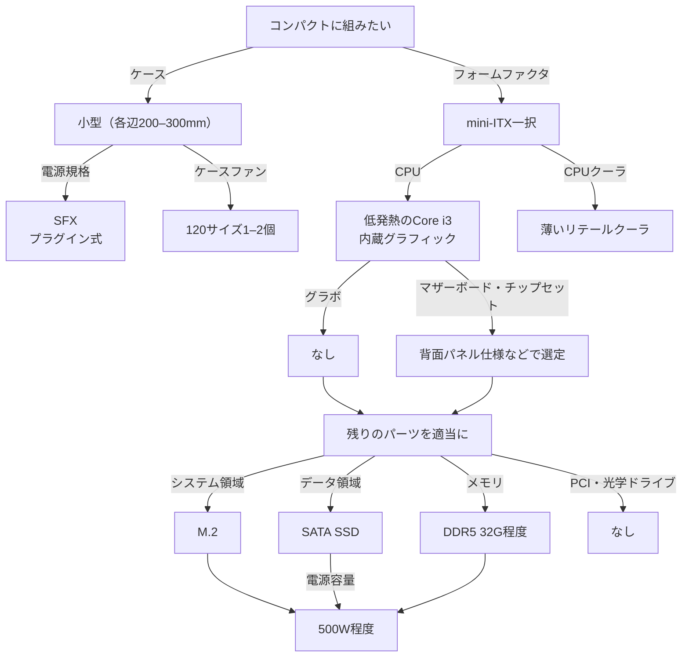
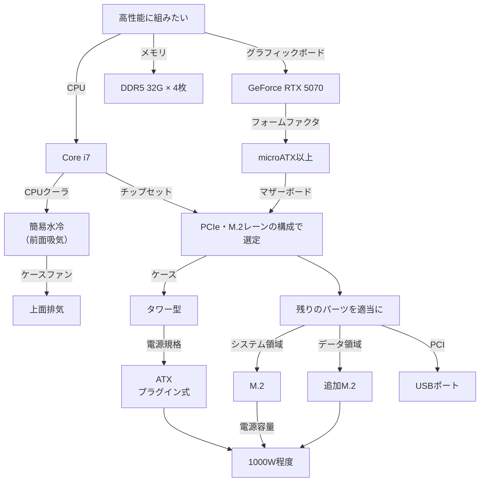
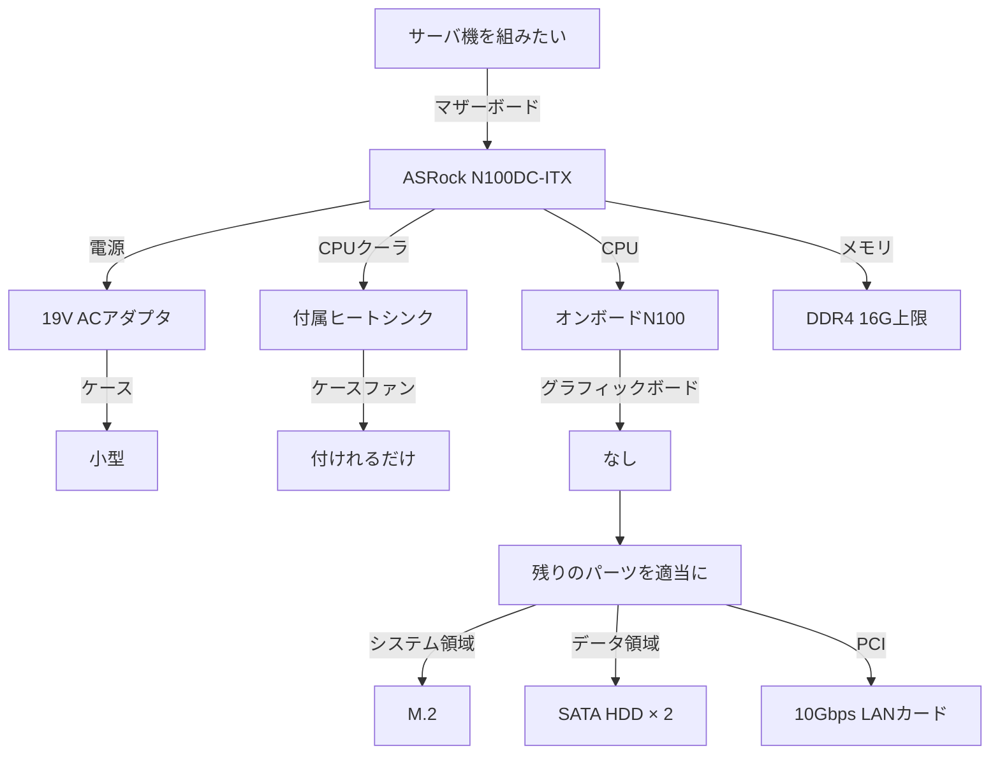
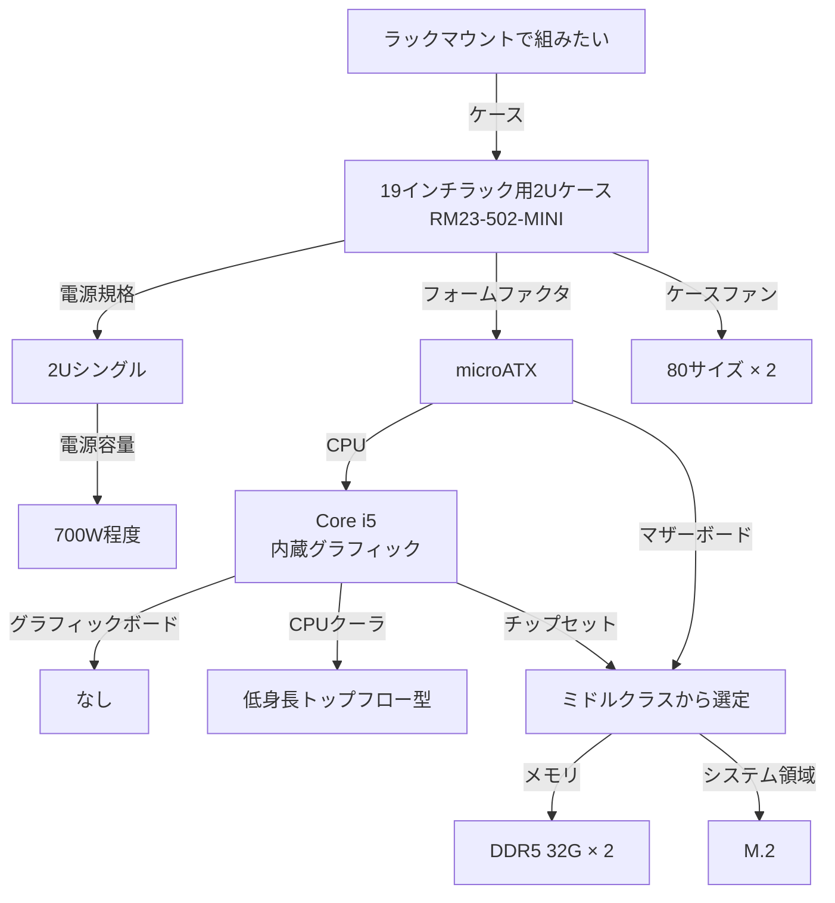

# 実験屋の自作PCパーツ選定

筆者はわりとむかしから、PCを自分で組むタイプの人間です。
学部生時代に買ってもらったPCは市販品でしたが、
院生になった際に組んだラボ用PCは自作でした。
（驚くべきことに、それがいまでも現役で、
依然としてわたしのデスクワーク用のメインPCです。
というか、この文章を書いているまさにこのPCです。）

現職になって5年超ですが、
この間も、かれこれ10台ほどPCを組んでいます。
日常業務のなかで、同僚のPCパーツ選定と組み立てを手伝ったり、
質問を受けたりする機会もあります。
ということで、あくまでわたし個人のやりかたですが、
パーツ選定の過程をサクッとまとめてみようと思います。

## もくじ

- Table of Contents
{:toc}

## なぜ自作PC？

いうまでもなく、研究においてPCは必須の道具です。
とくに実験研究の場合は、デスクワーク用のPCだけでなく、
機器制御やデータ集録に用いるPCが必要となってきます。
そのような実験用端末は、用途によって必要スペックも異なり、
設置場所や運用方法にもさまざまな制約が生じます。
そのため、市販のPCを適当に買うのではなく、
用途にあった性能やケーシングの端末を自身で組んだほうがよいのです。

ひとむかし前までは、自作PCのほうが価格面でも優位性がありました。
ただ、近年のAI特需によりPCパーツの値段は高騰しており、
執筆時点の現在では、
自分でPCを組んだとしてもそれなりの金額になってしまうことが多いです。
とはいえ、不要なパーツは避けて必要構成のPCをつくれることは、
依然としてエコではあります。

なお、ちまたでよくいわれるような「パーツの再利用が利く」
という点については、個人的にあまり感じません。
PCが壊れるころには、
なかのパーツにも再利用したいものが大概ないからです。
パーツのつかいまわしに関しては、
せいぜい「前回組んだときに買ったけどつかわなかった余剰部品が、
次回に流用できる（場合がある）」程度な気がします。

## 選定のながれ

PCパーツ選定の過程は、
パーツ間での互換性のあり/なしによって、
つかう部品が連鎖的に決まっていきます。
ケースバイケースではありますが、
筆者の場合によくある選定過程を、
何パターンかフローチャートにしてみます。

### コンパクトに組みたい

動画編集などをするハイスペック機を除けば、
筆者が自分用につくるPCは、
ほとんどが小型の筐体のものです。
でかいケースや排熱、大型ファンの音などが嫌だからです。
この場合、ケースサイズやマザーボードのフォームファクタが最初に決まってきます。

### 高性能に組みたい

研究用途としては、
金額に妥協せずハイスペックのPCを組む必要がある場合もあるでしょう。
ディープラーニングなどを効率よく行なうには、
GPUパワーも必要になります。
その場合は、まず性能関連のパーツから決まっていきます。
筆者は長らくIntel派なのでCore i7あたりを選んじゃいますが、
AMD Ryzenや、
資金が潤沢ならThreadripperなどもいつかは組んでみたいものです。

### サーバ機を組みたい

サーバとして運用するPCには、高いマシンスペックは不要で、
代わりに低発熱性や静音性、常時動作における堅牢性などが求められます。
わたしがサーバ機を組んだときには、
Intel N100を積んだDC動作のマザボが出回っていたため、
それを使用してみました。
つまりこのときは、マザーボードが最初に確定していて、
それを起点にパーツを選びました。

### ラックマウントで組みたい

実験用PCが増え、さまざまな規格のPC筐体が実験棚に並んでいると、
見た目も悪いし、管理や配線も煩雑になってきます。
そこでわたしの所属研究室では、あるとき思い切って、
実験用PCをガサっとラックマウントで組み直して更新しました。
この場合、各PCの必要スペックは用途ごとに違いますが、
使用する筐体は2ユニットサイズのラックマウントシャーシで揃えました。
つまり選定の起点はケース規格ということになります。

## 各パーツの選択肢

このようにPCパーツの選定は、優先したい仕様・規格を起点として、
他の部品が順次決まっていくというのが一般的かと思います。
上記の例からもわかるとおり、
なにを重視するかにより、そのフローは結構多様です。

以下では、各パーツにおける代表的な選択肢について簡単に触れておきます。

### CPU

- Intel
- AMD

CPUについては、まずIntelかAMDかを決めて、
さらに必要スペックにあわせたグレードのものを選ぶと思います。
わたしはずっとIntel派なので、
理由がなければとりあえずIntelを選んでしまいます。
ただ、件の第13・14世代Intel CPU事件などもあり、
今後はAMDも視野に入ってきそうです。
大昔は「正統派ならIntel、安かろう悪かろうでよければAMD」
みたいな雰囲気もありましたが、
現代においては全然そんなこともありません。

またCPU選定では、内蔵グラフィック機能の有無にも注意が要ります。
グラボを載せないつもりなら、
GPU内蔵型のCPUを選ぶ必要があります。
逆にどうせグラフィックボードをつかうのであれば、
GPU非搭載のCPUのほうが安く済みます。
ただ、グラフィックボードをつかうにしても、
グラボ故障時にとりあえずマザーボードから映像が出せるなど、
内蔵グラフィックがあると助かる場合があります。
わたしは3Dゲームをやるわけでもないし、
内蔵グラフィックで充分満足なタイプなので、
大概はGPUつきのCPUを選びます。

### マザーボード

- ATX
- microATX
- mini-ITX

一般的には、上記の代表的フォームファクタから選びます。
extended-ATX（eATX）やXL-ATXといった、もっとでかい規格もあります。
前述のとおり、筆者はたいがいmini-ITXを最初に考えます。
PCIeスロット数の制限が厳しくなるので、そこは兼ね合いです。

マザーボードは、
選定したCPUに適合するCPUソケットのものである必要があります。
CPU・マザボのどちらかが決まった時点でCPUソケットが決まるので、
それに合わせて他方を決めることになります。
チップセットもマザボを決めると確定しますが、
チップセット性能については、ぶっちゃけ筆者は重視していません。
CPUに適合していれば、それでよいというスタンスです。

むかしはCPUとチップセットの組み合わせで、
内蔵グラフィックの利用可否が決まっていました。
いま現在は、GPU機能のついているCPUであれば、
基本的にマザボだけで映像出力が可能と考えてよいようです。
（自作PC老人会の人間なので、知りませんでした；）

### メモリ（RAM）

- DDR5
- DDR4

じきに完全移行するのでしょうが、現在のところはまだ、
DDR5と4の規格のメモリが並行して流通しています。
マザーボードによってつかえるメモリが決まるので、
そこに注意して選びます。

容量は基本、大きければ大きいほどよいです。
Win11をつかうなら、最低でも16Gbは欲しいでしょうか。
もっと少なくても動くは動くけど、
可能なら余裕をもって32Gbくらい積んどきたい感じ。
ただ、サーバPCのように性能より低発熱を優先したい場合など、
あえてたくさん積まない選択もあります。
また、ちょっとまえなら
「どうせ1万円くらいの差だしガッツリ積んどけ」
という感じでしたが、
近年のAI特需の影響で、メモリも価格が高騰しています。
16Gbの2枚挿しでも、ちょっと躊躇する値段だったりするので、
しょうがなく少なめにするケースもあります。

メモリのPC5-38400とか44800とかいう数値は、
動作速度関連のスペックを表わしています。
もうひとつ、DDR5-4800とか5600とかいう数値もあります。
これは前出のPC5うんぬんと、もっている情報はおなじです。
（別記法だと思って構いません。）
性能を示すパラメータではあるのですが、
この数値は正直、体感速度にはあまり反映されません。
また、これらのスペックには下位互換があり、
高機能のメモリを挿しても、
マザボ側の性能にあわせて動いてくれます。
総じてあまりこだわる必要がないので、
筆者はDDR5/4と容量だけで選んでしまいます。

なおラップトップPC向けメモリは、
SO-DIMMというスロットも形状もまったく違う製品をつかいます。
そちらにもDDR5や4といった規格がありますが、
デスクトップPC用メモリとの互換性はありません。

### グラフィックボード

- NVIDIA GeForce
- AMD Radeon
- Intel Arc

グラフィックボードは、ピンからキリまで多種多様なので、
自分の用途にあったものを（必要なら）選びます。
わたしのつくるPCの場合、
だいたい半数以上はCPU内蔵グラフィックでまかなうので、
グラボを積むケースのほうが少ないです。

グラボを積む場合には、
上記の3種のGPUからチップを選んだうえで、
さらに各社から出ている製品の仕様を比較することになります。
グラボ性能をきちんとつかおうと思ったら、
結構まじめに選定する必要があります。
たとえば映像編集につかいたいとか、並列計算につかいたいとか、
それぞれの用途にあわせて、
使用ソフトやチップ・ドライバの対応を調べてやる必要があります。

### ケース

- フルタワー
- ミドルタワー
- ミニタワー
- スリム型
- キューブ型
- ラックマウント

PC筐体は、実用的には結構重要なパーツです。
置き場所にあわせて選定しますが、
棚にピチピチにおさまる筐体だと、
給排気が阻害される場合があります。
小型の筐体にすれば、ケースまわりの空間は確保しやすいですが、
一方でPC内のエアフローや熱のこもりは大型ケースのほうが有利です。

フローチャートにも挙げたラックマウントケースというのは、
一般的にはちょっとレアだと思います。
でも、実験室環境においてはかなり有用なので、
選択肢として覚えておいて損はないです。

ケースの大きさと関連する内部パーツは、
おもに以下のとおりです。
せっかく買ったパーツがケースに入らなかったら悲しいので、
そこは慎重に選びます。
- マザボのフォームファクタ
- グラボの長さ
- CPUクーラの高さ
- ケースファンの数とサイズ
- 5/3.5/2.5インチベイの数と位置
- 電源ユニットの規格と位置

ケースを決めると、
つけられるマザーボードと電源ユニットの規格が確定します。
ケースによっては電源ユニットが付属する製品もあります。
ただ、たいていはあまり性能がよくなかったり、
非プラグイン式の電源（下記）なので、
別途きちんとしたものを買ったほうがよいかもしれません。

### 電源ユニット（PSU）

- ATX
- SFX

自作PC界隈でつかう電源ユニットには、
大きくATXとSFXという2種のフォームファクタがあります。
基本的には、PC筐体によってどちらが使えるかが決まります。

ATXは「普通のデスクトップPC用」の電源で、
製品数も多いです。
SFXのほうはボディが小さく、小型ケース向きです。
そのため選択肢も少ないし、容量のわりに高めな傾向にあります。
ATXのシャーシにSFX電源をつけるアダプタなどもありますが、
ATX電源がつかえるなら、おとなしくそうしたほうがよいです。
（逆は物理的に無理なはずです。）

電源ユニットで重要なのが、プラグイン式のものを選ぶことです。
これは、必要なケーブルだけを脱着して使用できる機能です。
そうでないと、
つかいもしないATAの電源ケーブルまで山ほど生えたタコ足の電源ユニットを、
ケース内に押し込めるはめになります。
ホコリもたまるし、エアフローも阻害されるし、いいことなしです。
マザボやCPUの給電ケーブルは外れなくても構いませんが
（ほぼ必ずつかうので）、
SATAやグラボにいくケーブルはプラグインで付け外しできるものを選びます。

電源容量については、
小型PCなら500W、ミドルクラスで800Wくらいあれば、
たいてい大丈夫だと思います。
ハイエンドCPUとグラボを積んだ場合は、
1200Wとか、それ以上になるかもしれません。
といっても、常時そんな大電流をつかうわけではないです。
使用するパーツの定格の総和を取り、
その倍くらいの容量の電源を余裕をみて選ぶと、
上記のような値になります。
慣れないうちはあんばいがつかめないので、ドスパラさんのサイトにある
[電源容量計算機](https://www.dospara.co.jp/5info/cts_str_power_calculation_main.html)
をつかうと便利で安心です。

### CPUクーラ

- リテールクーラ
- 大型ヒートシンク
- 簡易水冷

CPUはいちばん発熱するパーツのひとつです。
高性能なCPUを選んだ場合は、
CPU冷却も考える必要があります。
大きなヒートシンクとファンがついた、
ゴツいCPUクーラなどもあります。
また簡易水冷といって、
ケースファンからホース経由で冷却水を循環させて冷やすタイプもあります。
一方、低発熱のCPUを選んでいるのなら、
CPUに付属のリテールクーラで充分です。

### 記憶領域

- M.2 SSD
- SATA SSD
- HDD

「資金の都合でしかたなく」というのでなければ、
いま時分システムボリュームにする記憶領域は、
M.2 SSD一択なのではないかと思います。
SATA SSDが出た当初は感動したものですが、
それよりさらにM.2のほうが高速です。
OSの起動時間などに直結します。
またSATAデバイスがなければ、
筐体内の配線が減ってエアフローもよくなるし、
掃除もラクになります。

ただ、記憶媒体もAI特需で高騰しており、
おいそれと大容量のものが買えなくなっています。
その場合、容量が少なくてもいいので、
OSを入れるドライブだけはM.2にする手があります。
逆に、大容量の動画データなどを日々扱うしごとであれば、
それらのデータを入れるドライブを高性能のM.2にするとはかどります。
ただし、M.2のSSDは世代によってはかなり発熱します。
マザボ付属のヒートシンクなどがないスロットの場合は、
別途、ヒートシンクやM.2用ファンの使用を検討してください。

M.2 SSDにもいくつかの規格があるので、
選ぶうえでは、マザーボードとの適合に気をつけます。
まずサイズのうえで、長さに80・60・42mmの3規格があります。
それぞれtype2280・2260・2242と呼ばれます。
記憶領域としてつかうのは、普通は長いtype2280です。
type2242は、マザボ付属の無線LANアダプタなどでよく見かけます。
マザボのM.2スロットが複数ある場合など、
一部が2242専用の短いスペースだったりすることがあるので気をつけます。

また、M.2の通信様式にNVMeとSATAという2種の規格があります。
（SATAといっても、いわゆるSATAケーブルでつなぐわけではないです。
マザボに直挿しのM.2だけど、通信にSATAのプロトコルを用いている、
ということです。）
両者はコネクタ形状がそもそも違うので、
マザボのM.2スロットと違うものを選ぶとつきません。
SATA型は古い規格であり、通信も遅いので、
いま選ぶなら通信にPCIeを利用するNVMe型一択だと思います。
マザボの仕様に「M.2 NMVe」とか「M.2（PCIe）」とか書いてあれば大丈夫です。

なお、現代においてシステム領域にHDDをつかうのは、
相当なマゾヒストだけです。
若者に「ヒぃー」といわせるためにあえてするのでなければ、
おとなしくSSDをつかいます。

### PCI expressカード

マザボをmini-ITXにしがちなこともあり、
わたし自身はPCIカードを追加することがあまりありません。
mini-ITXボードには、PCIeスロットが1つしかないためです。
速度も遅い場合が多いです。

microATX以上なら、グラボを積んだとしても、
追加でPCIカードをつける選択肢がいろいろあります。
USBポートを追加したり、
キャプチャボードをつけたりでしょうか。
10Gbpsのネットワークカードをつけて10G LANを組むと、
LAN内のファイル転送がめちゃめちゃ快適になります。
（10GBASE-Tを搭載したルータなどが要ることになりますが。）

### OS

一般のかたはWindowsをつかいたいと思うので、
その場合はOSも購入する必要があります。
普通はHomeエディションで構わないと思います。
Pro版が速いとか高性能とかいうことは、とくにありません。
ProとHomeの機能を比較して、
欲しい機能がある場合のみProエディションを選ぶ意味があります。
（たとえばリモートデスクトップホストにしたい、など。）

むかしはDSP版（delivery service partner版）という、
パーツとセット売りのWindowsライセンスをつかうのが、
自作PCでは主流でした。
PCIカードなどとセットで売っているくせに、
明らかに安かったからです。
ただ、現在のWindows 11の価格をみると、
そのDSP版の優位性はほぼ失われた感じです。
というか、そもそもDSP版自体が減っています。
普通にパッケージ版のWindows 11ライセンスを買えばよいでしょう。

ちなみに筆者はLinuxユーザなので、
自分用にOSを買うことは少ないです。
なんだかんだでUbuntuが便利なので、
とくに考えずに最新のLTS（long-term support）のUbuntuを入れています。

### その他

むかしはPCといえば光学ドライブ必須でした。
いまはつけないほうが主流になった気がします。
そのため、大きな筐体でも5インチベイはもてあますケースが多いです。
余った5インチベイを3.5インチや2.5インチのベイに変換したり、
鍵つきの小物入れにしたりする製品なんかも売っています。
秘密の改造っぽくて、ちょっと楽しいです。
（まぁ要らないけど。）

## 組み立て

パーツが選定できたら、あとは購入して組み立てるだけです。
組み立ての過程については、ことばで説明するのも難しいし、
本稿では省略します。
基本、つくようにしかつかないので、
通販サイトの説明などを見ながらやれば、
プラモデルをつくるのより難しくありません。
PCケースには、
おおざっぱな組み立て手順のマニュアルが付属することも多いです。

ポイントとしては、CPU・メモリ・M.2などは先にマザボに組み付けてしまうこと。
あとは、マザボをケースにおさめるまえに、
背面パネルを忘れずはめておくことくらいでしょうか。
グラボや簡易水冷など大きいパーツは、
他のパーツとの干渉を避けられるよう組み付ける順を考えます。
電源ユニットから各部に給電ケーブルをつなぎ、
前面ボタンやUSBパネル、ファンなどの配線をマザボにつなぎます。

組みあがったら、筐体を閉じるまえに一旦起動を確認しておくのがよいでしょう。
BIOSの画面まで立ちあがればOKです。
OSのメディアを挿して再起動すれば、
インストールウィザードが実行されるはずです。

最近のWindowsは、
インストール時点でMicrosoftアカウントとの連携を強制してくる仕様になっています。
ただラボ用PCの場合、自身の個人アカウントとは連携したくないでしょう。
インストール途中でコマンドプロンプトを介することで、
ローカルアカウントだけでセットアップを進める方法があります。
検索すればすぐみつかるので、それに沿ってセットアップしましょう。

## 改訂履歴

- 2026.09.13（ver.1.0.0）初版
- 2026.09.14（ver.1.0.1）全体にこまかい加筆修正
- 2026.09.14（ver.1.1.0）OSについてを追加
- 2026.09.14（ver.1.2.0）組み立てについての項を追加

