# 実験屋の逆引き器械工作辞典

実験研究では、さまざまなレベルの器械加工が往々にして必要になります。
なんでもかんでも業者さんにお願いしていると高くつくし、
それ以上に、研究のテンポが悪くなります。
（そもそも田舎では、お金がかかるという以前に、
頼める業者さんがなかったりします。）
ちょっとしたことであれば、自分で工作できると非常に便利です。

このページでは、筆者が所属教室で担当するそんな器械工作を、
逆引きのかたちで集めてみました。
必要な機能に対して、それを実現する方法にどんなものがあるかをサッと調べる、
あるいは事前に知っておくために、活用してもらえれば嬉しいです。

## 注意事項

- すべての内容は「筆者が考える第一選択」であって、唯一解とは限りません。
- 筆者自身、記載したすべての作業に精通しているわけではありません。
- アスタリスク＊付きは、一般的にやや高難度と考えられる作業です。
- 作業は充分な手順確認ののち、安全第一で、自らの責任のもと行なってください。
- 本文書内容に起因した怪我や不利益について、筆者は一切責任を負いません。

## もくじ

- Table of Contents
{:toc}

## 穴あけ

### 丸穴をあけたい

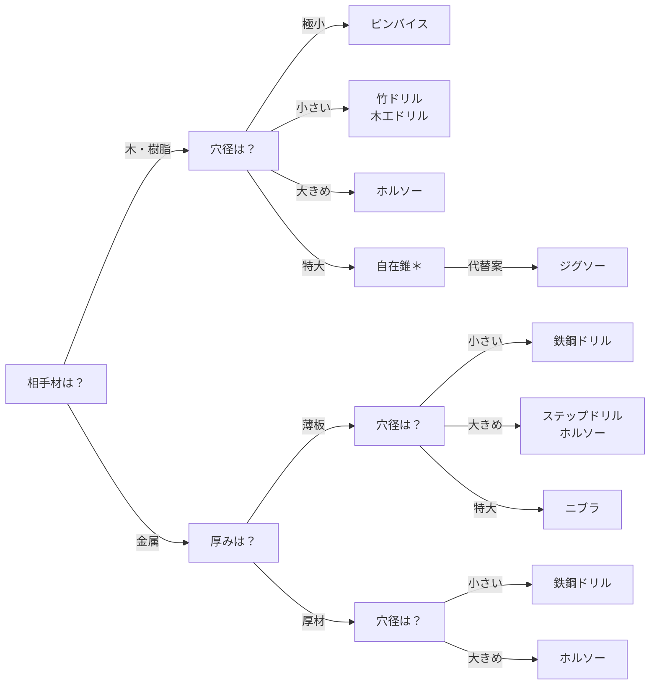
```mermaid
flowchart LR;
Start["相手材は？"]--"木・樹脂"-->Wood["穴径は？"];
Wood--"極小"-->W1["ピンバイス"];
Wood--"小さい"-->W2["竹ドリル\n木工ドリル"];
Wood--"大きめ"-->W3["ホルソー"];
Wood--"特大"-->W4["自在錐＊"];
W4--"代替案"-->PlanB["ジグソー"];
Start--"金属"-->Metal["厚みは？"];
Metal--"薄板"-->Board["穴径は？"];
Board--"小さい"-->B1["鉄鋼ドリル"];
Board--"大きめ"-->B2["ステップドリル\nホルソー"];
Board--"特大"-->B3["ニブラ"];
Metal--"厚材"-->Thick["穴径は？"];
Thick--"小さい"-->T1["鉄鋼ドリル"];
Thick--"大きめ"-->T2["ホルソー"];
```

### めねじを立てたい

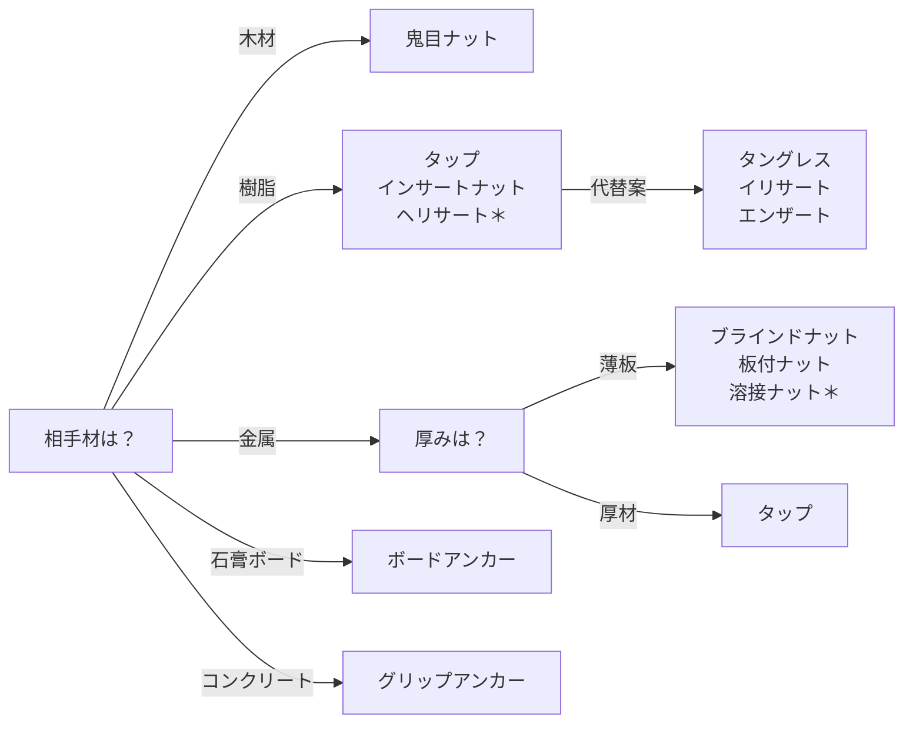
```mermaid
flowchart LR;
Start["相手材は？"]--"木材"-->Wood["鬼目ナット"];
Start--"樹脂"-->Plastic["タップ\nインサートナット\nヘリサート＊"];
Plastic--"代替案"-->PlanB["タングレス\nイリサート\nエンザート"];
Start--"金属"-->Metal["厚みは？"];
Metal--"薄板"-->Board["ブラインドナット\n板付ナット\n溶接ナット＊"];
Metal--"厚材"-->Thick["タップ"];
Start--"石膏ボード"-->Plaster["ボードアンカー"];
Start--"コンクリート"-->Concrete["グリップアンカー"];
```

### おねじを立てたい

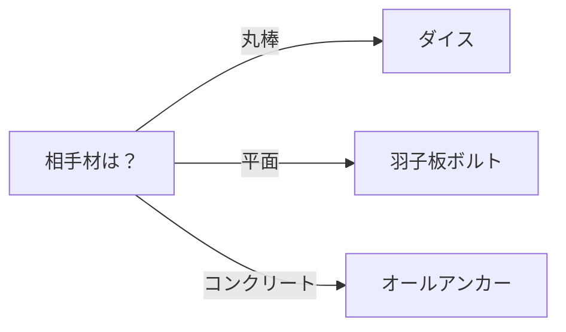
```mermaid
flowchart LR;
Start["相手材は？"]--"丸棒"-->Bar["ダイス"];
Start--"平面"-->Board["羽子板ボルト"];
Start--"コンクリート"-->Concrete["オールアンカー"];
```

### <ruby>管用<rp>（</rp><rt>くだよう</rt><rp>）</rp></ruby>ねじを立てたい

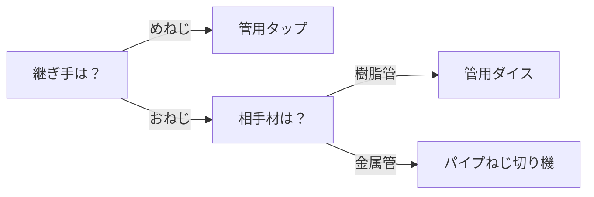
```mermaid
flowchart LR;
Start["継ぎ手は？"]--"めねじ"-->Female["管用タップ"];
Start--"おねじ"-->Male["相手材は？"];
Male--"樹脂管"-->Plastic["管用ダイス"];
Male--"金属管"-->Metal["パイプねじ切り機"];
```

## 切断

### 板を真っ直ぐ切りたい

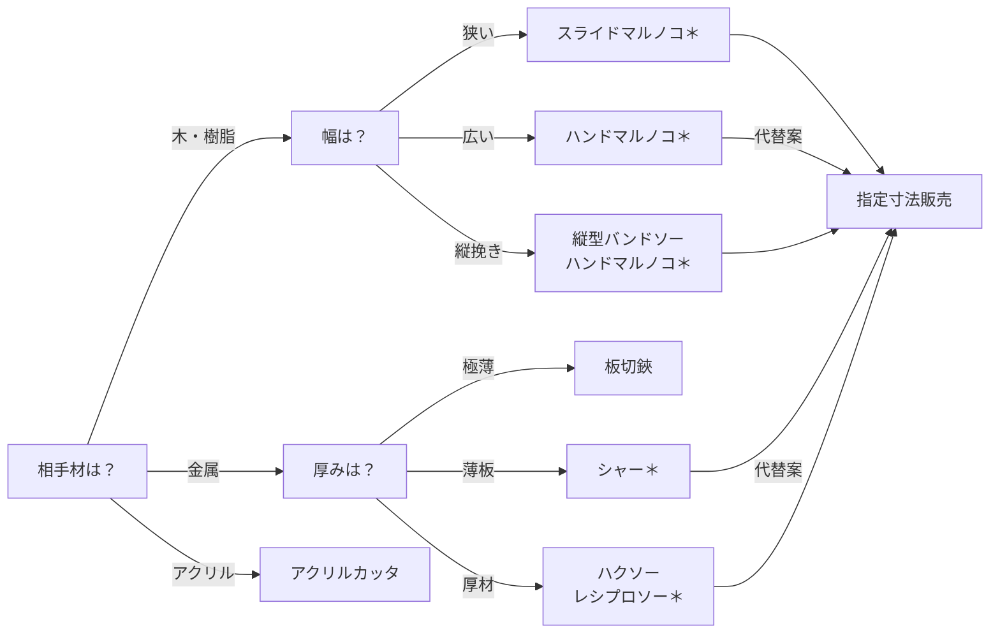
```mermaid
flowchart LR;
Start["相手材は？"]--"木・樹脂"-->Wood["幅は？"];
Wood--"狭い"-->W1["スライドマルノコ＊"];
Wood--"広い"-->W2["ハンドマルノコ＊"];
Wood--"縦挽き"-->W3["縦型バンドソー\nハンドマルノコ＊"];
W1-->PlanB["指定寸法販売"];
W2--"代替案"-->PlanB;
W3-->PlanB;
Start--"金属"-->Metal["厚みは？"];
Metal--"極薄"-->M1["板切鋏"];
Metal--"薄板"-->M2["シャー＊"];
Metal--"厚材"-->M3["ハクソー\nレシプロソー＊"];
M2--"代替案"-->PlanB;
M3-->PlanB;
Start--"アクリル"-->Acrylic["アクリルカッタ"];
```

### 板を自由切断したい

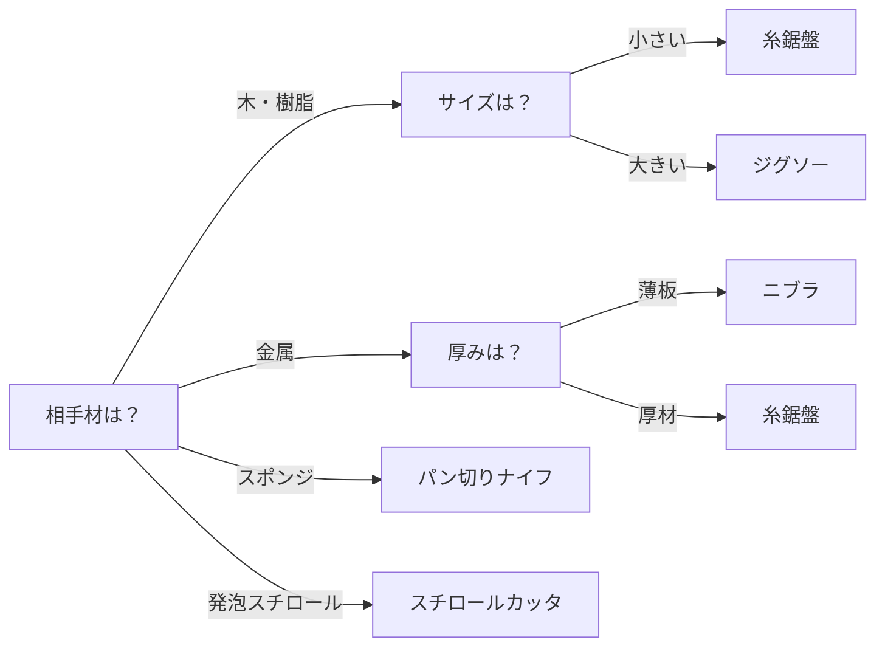
```mermaid
flowchart LR;
Start["相手材は？"]--"木・樹脂"-->Wood["サイズは？"];
Wood--"小さい"-->Small["糸鋸盤"];
Wood--"大きい"-->Large["ジグソー"];
Start--"金属"-->Metal["厚みは？"];
Metal--"薄板"-->Board["ニブラ"];
Metal--"厚材"-->Thick["糸鋸盤"];
Start--"スポンジ"-->Sponge["パン切りナイフ"];
Start--"発泡スチロール"-->Styrol["スチロールカッタ"];
```

### 長尺物を切りたい

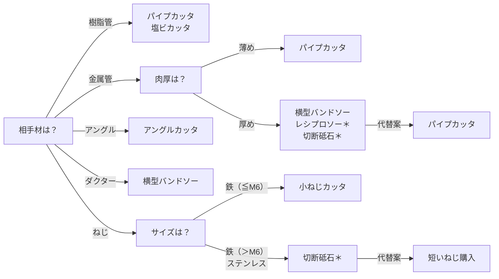
```mermaid
flowchart LR;
Start["相手材は？"]--"樹脂管"-->Tube["パイプカッタ\n塩ビカッタ"];
Start--"金属管"-->Metal["肉厚は？"];
Metal--"薄め"-->Thin["パイプカッタ"];
Metal--"厚め"-->Thick["横型バンドソー\nレシプロソー＊\n切断砥石＊"];
Thick--"代替案"-->PlanB["パイプカッタ"];
Start--"アングル"-->Angle["アングルカッタ"];
Start--"ダクター"-->Ducter["横型バンドソー"];
Start--"ねじ"-->Screw["サイズは？"];
Screw--"鉄（≦M6）"-->S1["小ねじカッタ"];
Screw--"鉄（＞M6）\nステンレス"-->S2["切断砥石＊"];
S2--"代替案"-->PlanC["短いねじ購入"];
```

## 面取り

### バリを取りたい

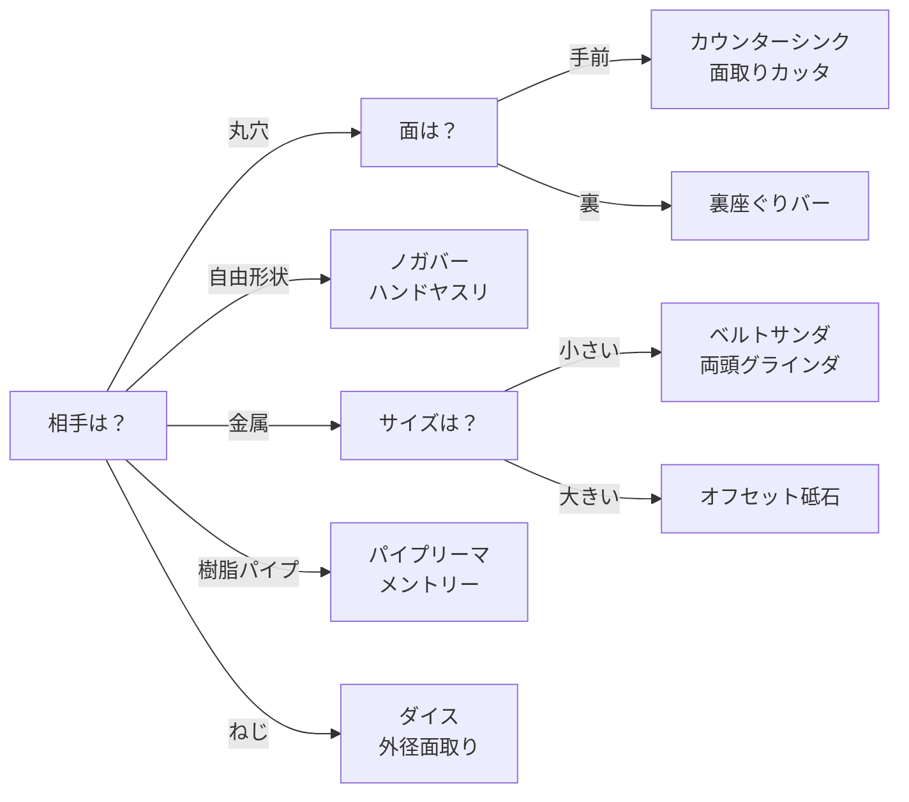
```mermaid
flowchart LR;
Start["相手は？"]--"丸穴"-->Round["面は？"];
Round--"手前"-->R1["カウンターシンク\n面取りカッタ"];
Round--"裏"-->R2["裏座ぐりバー"];
Start--"自由形状"-->Free["ノガバー\nハンドヤスリ"];
Start--"金属"-->Metal["サイズは？"];
Metal--"小さい"-->M1["ベルトサンダ\n両頭グラインダ"];
Metal--"大きい"-->M2["オフセット砥石"];
Start--"樹脂パイプ"-->Plastic["パイプリーマ\nメントリー"];
Start--"ねじ"-->Screw["ダイス\n外径面取り"];
```

### 削りたい

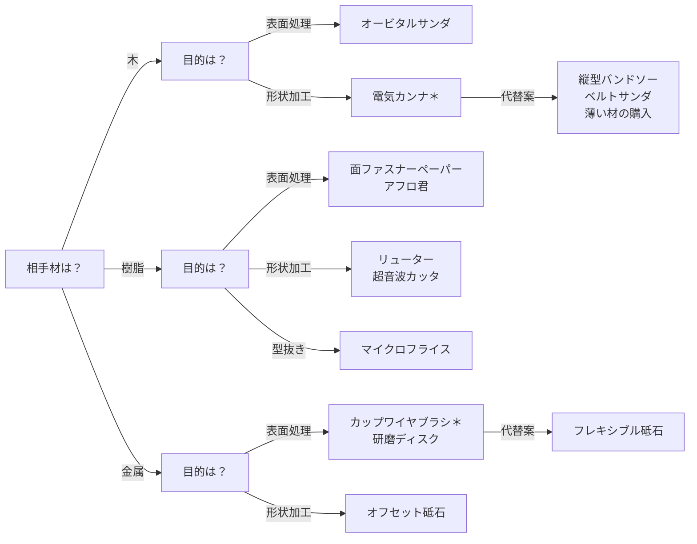
```mermaid
flowchart LR;
Start["相手材は？"]--"木"-->Wood["目的は？"];
Wood--"表面処理"-->W1["オービタルサンダ"];
Wood--"形状加工"-->W2["電気カンナ＊"];
W2--"代替案"-->PlanB["縦型バンドソー\nベルトサンダ\n薄い材の購入"];
Start--"樹脂"-->Plastic["目的は？"];
Plastic--"表面処理"-->P1["面ファスナーペーパー\nアフロ君"];
Plastic--"形状加工"-->P2["リューター\n超音波カッタ"];
Plastic--"型抜き"-->P3["マイクロフライス"];
Start--"金属"-->Metal["目的は？"];
Metal--"表面処理"-->M1["カップワイヤブラシ＊\n研磨ディスク"];
M1--"代替案"-->PlanC["フレキシブル砥石"];
Metal--"形状加工"-->M2["オフセット砥石"];
```

### 建具の角を落としたい

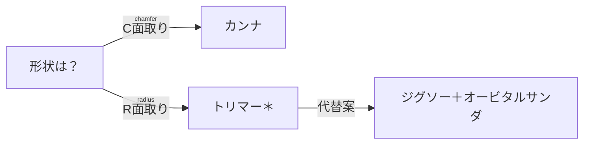
```mermaid
flowchart LR;
Start["形状は？"]--"<ruby>C面取り<rp>（</rp><rt>chamfer</rt><rp>）</rp></ruby>"-->Plane["カンナ"];
Start--"<ruby>R面取り<rp>（</rp><rt>radius</rt><rp>）</rp></ruby>"-->Router["トリマー＊"];
Router--"代替案"-->PlanB["ジグソー＋オービタルサンダ"];
```

## 接合

### ねじ締結したい

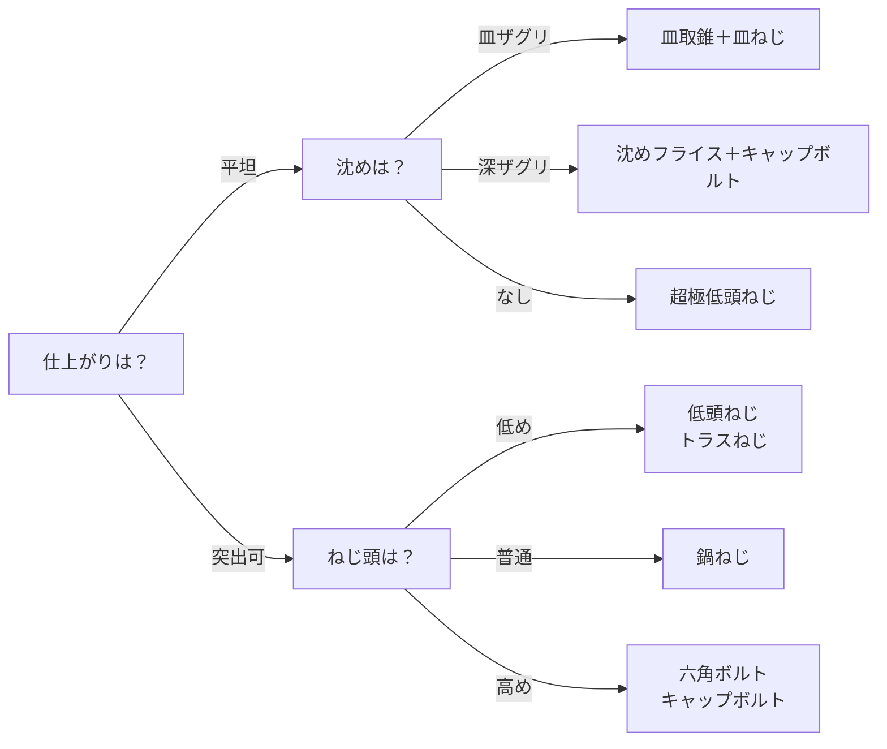
```mermaid
flowchart LR;
Start["仕上がりは？"]--"平坦"-->Flat["沈めは？"];
Flat--"皿ザグリ"-->F1["皿取錐＋皿ねじ"];
Flat--"深ザグリ"-->F2["沈めフライス＋キャップボルト"];
Flat--"なし"-->F3["超極低頭ねじ"];
Start--"突出可"-->Bump["ねじ頭は？"];
Bump--"低め"-->B1["低頭ねじ\nトラスねじ"];
Bump--"普通"-->B2["鍋ねじ"];
Bump--"高め"-->B3["六角ボルト\nキャップボルト"];
```

### ナメたねじを外したい

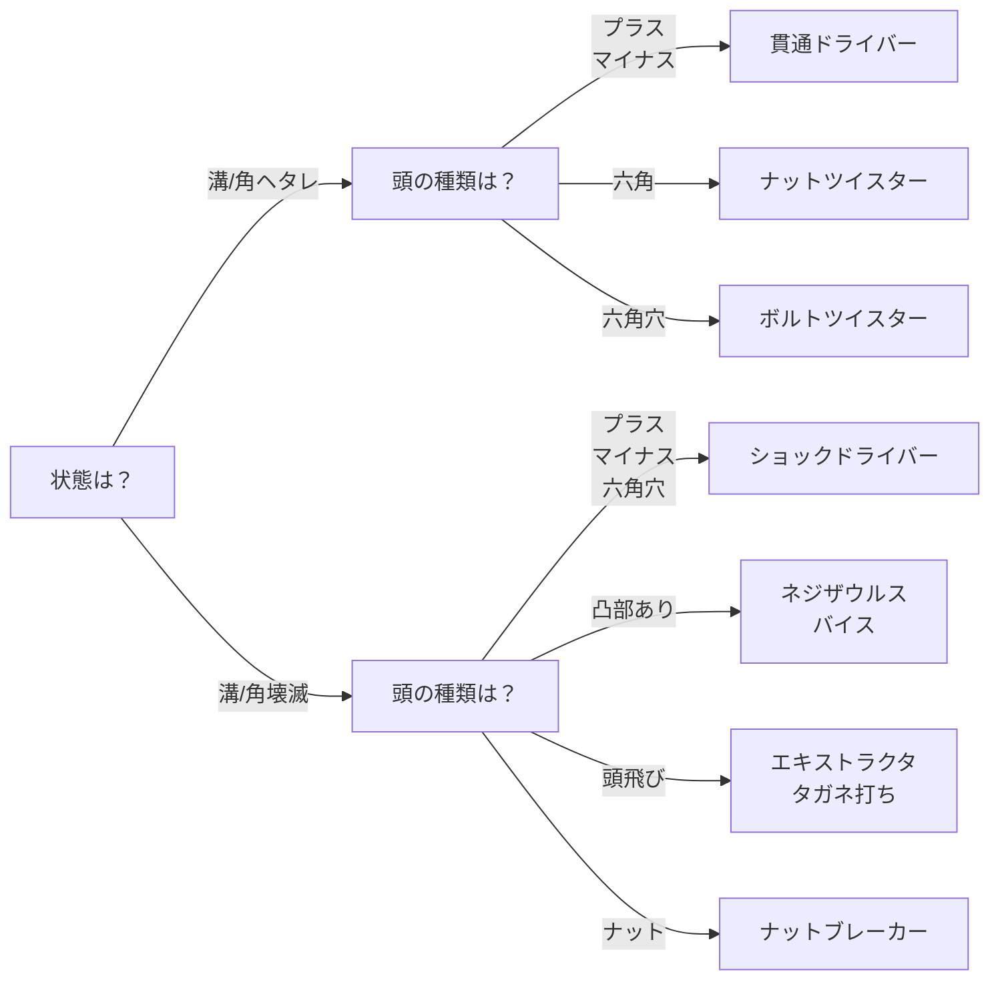
```mermaid
flowchart LR;
Start["状態は？"]--"溝/角ヘタレ"-->Weak["頭の種類は？"];
Weak--"プラス\nマイナス"-->W1["貫通ドライバー"];
Weak--"六角"-->W2["ナットツイスター"];
Weak--"六角穴"-->W3["ボルトツイスター"];
Start--"溝/角壊滅"-->Ruin["頭の種類は？"];
Ruin--"プラス\nマイナス\n六角穴"-->R1["ショックドライバー"];
Ruin--"凸部あり"-->R2["ネジザウルス\nバイス"];
Ruin--"頭飛び"-->R3["エキストラクタ\nタガネ打ち"];
Ruin--"ナット"-->R4["ナットブレーカー"];
```

### 固いねじを外したい

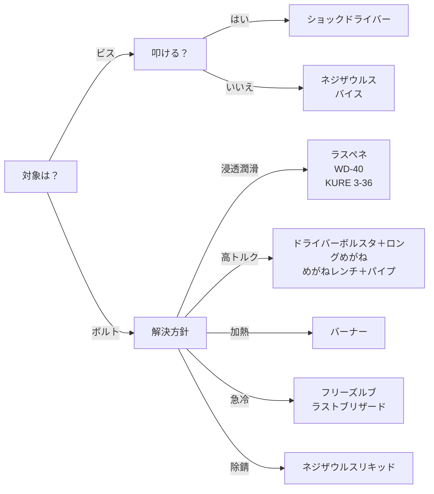
```mermaid
flowchart LR;
Start["対象は？"]--"ビス"-->Screw["叩ける？"];
Screw--"はい"-->S1["ショックドライバー"];
Screw--"いいえ"-->S2["ネジザウルス\nバイス"];
Start--"ボルト"-->Bolt["解決方針"];
Bolt--"浸透潤滑"-->B1["ラスペネ\nWD-40\nKURE 3-36"];
Bolt--"高トルク"-->B2["ドライバーボルスタ＋ロングめがね\nめがねレンチ＋パイプ"];
Bolt--"加熱"-->B3["バーナー"];
Bolt--"急冷"-->B4["フリーズルブ\nラストブリザード"];
Bolt--"除錆"-->B5["ネジザウルスリキッド"];
```

### ビス/ネイルを打ちたい

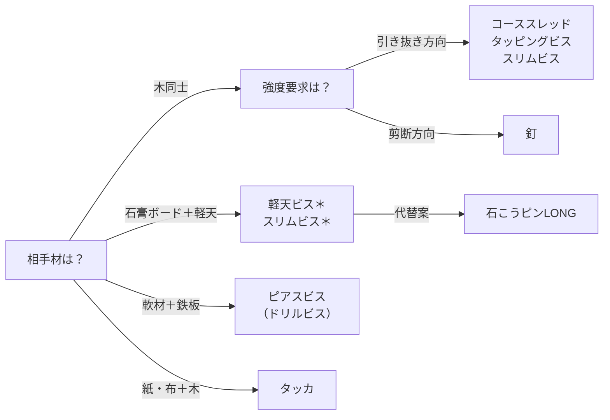
```mermaid
flowchart LR;
Start["相手材は？"]--"木同士"-->Wood["強度要求は？"];
Wood--"引き抜き方向"-->W1["コーススレッド\nタッピングビス\nスリムビス"];
Wood--"剪断方向"-->W2["釘"];
Start--"石膏ボード＋軽天"-->LGS["軽天ビス＊\nスリムビス＊"];
LGS--"代替案"-->PlanB["石こうピンLONG"];
Start--"軟材＋鉄板"-->Steel["ピアスビス\n（ドリルビス）"];
Start--"紙・布＋木"-->Staple["タッカ"];
```

### 接着したい

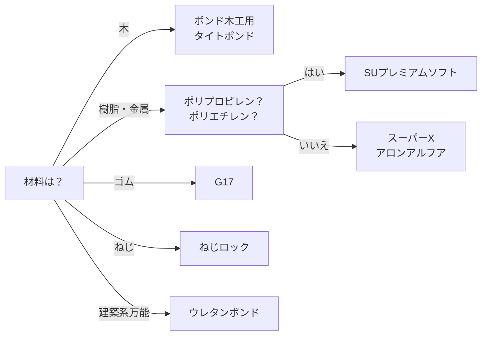
```mermaid
flowchart LR;
Start["材料は？"]--"木"-->Wood["ボンド木工用\nタイトボンド"];
Start--"樹脂・金属"-->Plastic["ポリプロピレン？\nポリエチレン？"];
Plastic--"はい"-->P1["SUプレミアムソフト"];
Plastic--"いいえ"-->P2["スーパーX\nアロンアルフア"];
Start--"ゴム"-->Rubber["G17"];
Start--"ねじ"-->Screw["ねじロック"];
Start--"建築系万能"-->Urethane["ウレタンボンド"];
```

### パテ埋め/盛りしたい

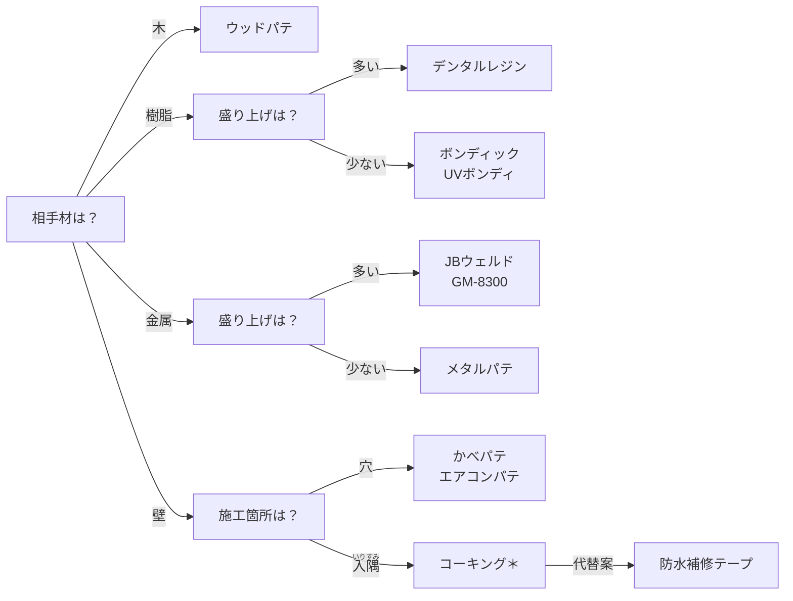
```mermaid
flowchart LR;
Start["相手材は？"]--"木"-->Wood["ウッドパテ"];
Start--"樹脂"-->Plastic["盛り上げは？"];
Plastic--"多い"-->P1["デンタルレジン"];
Plastic--"少ない"-->P2["ボンディック\nUVボンディ"];
Start--"金属"-->Metal["盛り上げは？"];
Metal--"多い"-->M1["JBウェルド\nGM-8300"];
Metal--"少ない"-->M2["メタルパテ"];
Start--"壁"-->Wall["施工箇所は？"];
Wall--"穴"-->W1["かべパテ\nエアコンパテ"];
Wall--"<ruby>入隅<rp>（</rp><rt>いりすみ</rt><rp>）</rp></ruby>"-->W2["コーキング＊"];
W2--"代替案"-->PlanB["防水補修テープ"];
```

## ケミカル

### 潤滑したい

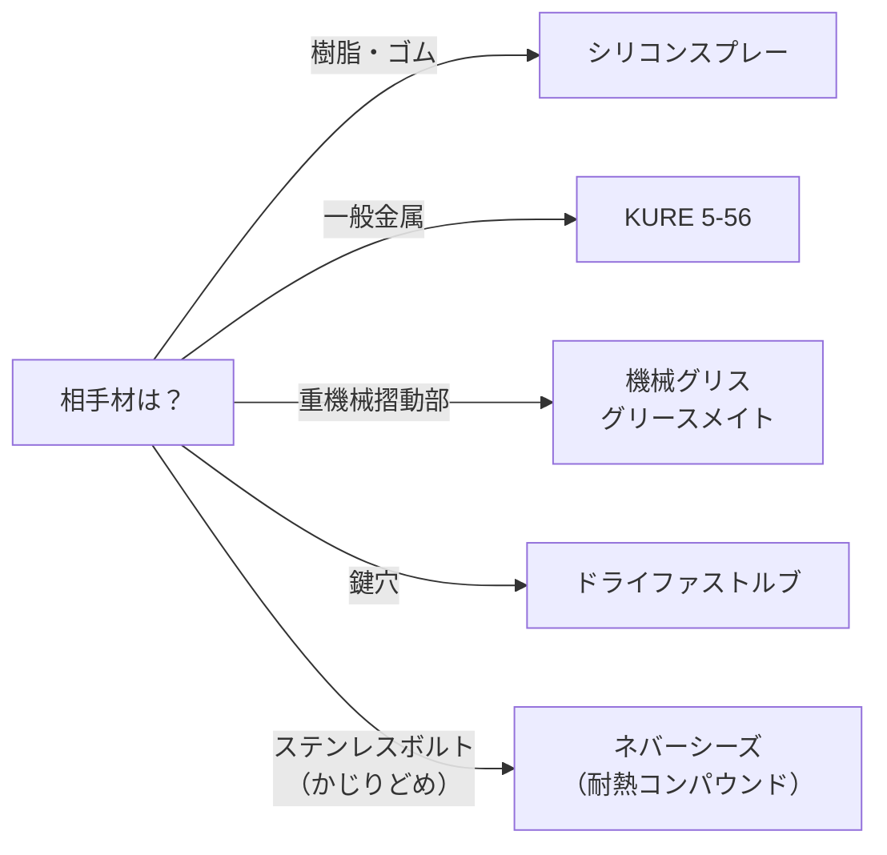
```mermaid
flowchart LR;
Start["相手材は？"]--"樹脂・ゴム"-->Plastic["シリコンスプレー"];
Start--"一般金属"-->Metal["KURE 5-56"];
Start--"重機械摺動部"-->Machine["機械グリス\nグリースメイト"];
Start--"鍵穴"-->Keyhole["ドライファストルブ"];
Start--"ステンレスボルト\n（かじりどめ）"-->Bolt["ネバーシーズ\n（耐熱コンパウンド）"];
```

### 洗浄したい

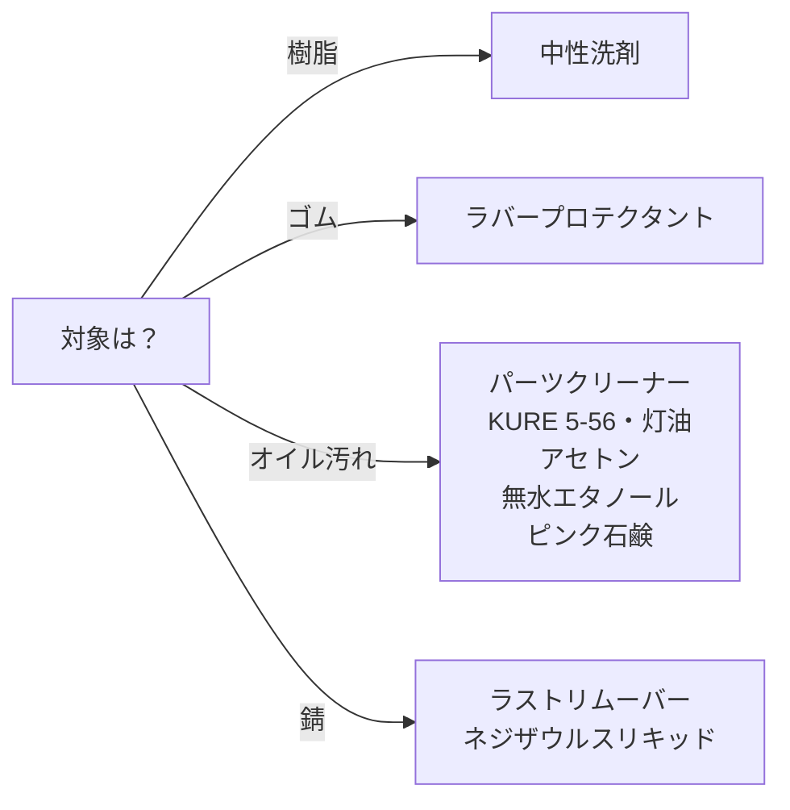
```mermaid
flowchart LR;
Start["対象は？"]--"樹脂"-->Plastic["中性洗剤"];
Start--"ゴム"-->Rubber["ラバープロテクタント"];
Start--"オイル汚れ"-->Oil["パーツクリーナー\nKURE 5-56・灯油\nアセトン\n無水エタノール\nピンク石鹸"];
Start--"錆"-->Stain["ラストリムーバー\nネジザウルスリキッド"];
```

### 防錆したい

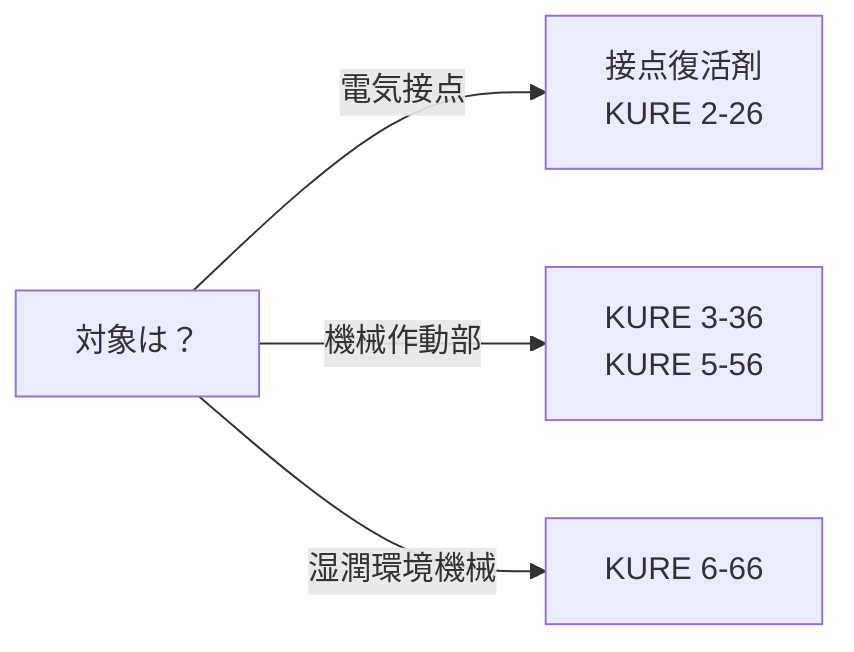
```mermaid
flowchart LR;
Start["対象は？"]--"電気接点"-->Contact["接点復活剤\nKURE 2-26"];
Start--"機械作動部"-->Machine["KURE 3-36\nKURE 5-56"];
Start--"湿潤環境機械"-->Marine["KURE 6-66"];
```

### 塗装したい

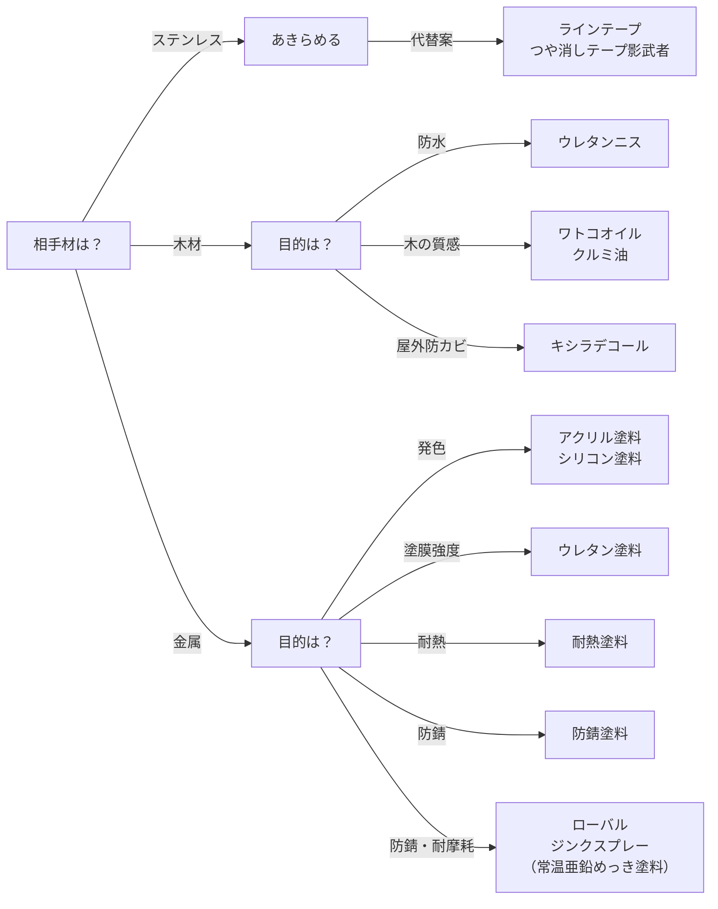
```mermaid
flowchart LR;
Start["相手材は？"]--"ステンレス"-->Stainless["あきらめる"];
Stainless--"代替案"-->PlanB["ラインテープ\nつや消しテープ影武者"];
Start--"木材"-->Wood["目的は？"];
Wood--"防水"-->Varnish["ウレタンニス"];
Wood--"木の質感"-->Oilstain["ワトコオイル\nクルミ油"];
Wood--"屋外防カビ"-->Xyladecor["キシラデコール"];
Start--"金属"-->Metal["目的は？"];
Metal--"発色"-->Color["アクリル塗料\nシリコン塗料"];
Metal--"塗膜強度"-->Thickness["ウレタン塗料"];
Metal--"耐熱"-->HeatResist["耐熱塗料"];
Metal--"防錆"-->StainResist["防錆塗料"];
Metal--"防錆・耐摩耗"-->Tough["ローバル\nジンクスプレー\n（常温亜鉛めっき塗料）"];
```

## 改訂履歴

- 2026.09.06（ver.0.0.1）作成開始
- 2026.09.08（ver.0.1.0）ひととおりの執筆完了・ラボ内公開
- 2026.09.08（ver.0.1.1）CCライセンスでの配布を決定
- 2026.09.09（ver.0.2.0）研磨・研削の項を追加、ねじ外しの項を分割
- 2026.09.09（ver.0.3.0）塗装の項を追加
- 2026.09.09（ver.0.4.0）難度の高い作業に代替案を追加
- 2026.09.10（ver.1.0.0）GitHub Pagesの利用を決定、リポジトリ作成のうえ公開 
  ※ GitHub PagesやJekyllの仕様にまだ慣れていないため、試しながら調整中
- 2026.09.12（ver.1.0.1）塗装の項に木材を追加
- 2026.09.12（ver.1.1.0）もくじを導入

